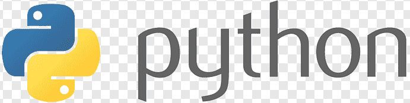

**Make A Synthesizer!** (43728)

> 9 AM - Noon, July 29-31, 2025 
{: .block-tip }

> The NeoTrellis-M4 is like a mini-computer with a grid of colorful, light-up buttons that you can press. It's a fun and easy-to-use device for creating light shows, music, or even simple games without needing extensive knowledge of electronics. This three-day course is designed to introduce Scratch, Python and micro-controllers. These tools allow children (10-14) to produce music or short videos and better understand computers.
{: .block-tip }

> **Cost:**  
> \$350 / session *OR*  
> \$315 / session for Chatham Marconi Supporting Members and above.  
{: .block-tip }

 

The Neotrellis device can be programmed to play several different games.    
This site introduces lessons in  
   and   
To play and programming quickly  

**Did you know?**
- *STEM = Science, Technology, Engineering, and Math*

This programming and electronics course was designed for the Marconi Radio Museum  
by Matt Curcio.

